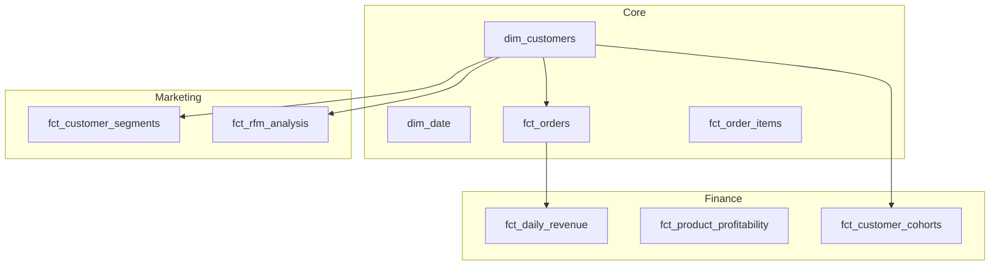

# Data Lineage & Architecture

This document provides comprehensive data lineage visualization beyond standard dbt docs, including business context and data flow explanations.

## Table of Contents
- [High-Level Architecture](#high-level-architecture)
- [Complete Data Flow](#complete-data-flow)
- [Layer-by-Layer Lineage](#layer-by-layer-lineage)
- [Critical Path Analysis](#critical-path-analysis)
- [Business Domain Mapping](#business-domain-mapping)
- [Impact Analysis](#impact-analysis)

---

## High-Level Architecture

```
┌─────────────────────────────────────────────────────────────────────────────┐
│                        E-COMMERCE ANALYTICS PLATFORM                         │
├─────────────────────────────────────────────────────────────────────────────┤
│                                                                              │
│  ┌──────────────┐    ┌──────────────┐    ┌──────────────┐    ┌────────────┐ │
│  │   SOURCES    │───▶│   STAGING    │───▶│ INTERMEDIATE │───▶│   MARTS    │ │
│  │              │    │              │    │              │    │            │ │
│  │ • Orders     │    │ • stg_*      │    │ • int_*      │    │ • dim_*    │ │
│  │ • Products   │    │ • Clean      │    │ • Enrich     │    │ • fct_*    │ │
│  │ • Users      │    │ • Type cast  │    │ • Join       │    │ • mart_*   │ │
│  │ • Returns    │    │ • Rename     │    │ • Calculate  │    │            │ │
│  └──────────────┘    └──────────────┘    └──────────────┘    └────────────┘ │
│         │                   │                   │                   │       │
│         ▼                   ▼                   ▼                   ▼       │
│  ┌──────────────┐    ┌──────────────┐    ┌──────────────┐    ┌────────────┐ │
│  │  SNAPSHOTS   │    │    TESTS     │    │   ANALYSES   │    │ EXPOSURES  │ │
│  │              │    │              │    │              │    │            │ │
│  │ • Products   │    │ • 138 tests  │    │ • Ad-hoc     │    │ • BI Tools │ │
│  │ • Customers  │    │ • Data qual  │    │ • Insights   │    │ • Reports  │ │
│  └──────────────┘    └──────────────┘    └──────────────┘    └────────────┘ │
│                                                                              │
└─────────────────────────────────────────────────────────────────────────────┘
```

---

## Complete Data Flow

### End-to-End Lineage Diagram

```
                              RAW DATA SOURCES
    ┌─────────────┬─────────────┬─────────────┬─────────────┬─────────────┐
    │ raw_orders  │raw_order_   │raw_products │ raw_users   │ raw_returns │
    │             │   items     │             │             │             │
    └──────┬──────┴──────┬──────┴──────┬──────┴──────┬──────┴──────┬──────┘
           │             │             │             │             │
           ▼             ▼             ▼             ▼             ▼
    ┌─────────────┬─────────────┬─────────────┬─────────────┬─────────────┐
    │ stg_orders  │stg_order_   │stg_products │  stg_users  │ stg_returns │
    │             │   items     │             │             │             │
    │ • order_id  │• order_     │• product_id │• user_id    │• return_id  │
    │ • user_id   │  item_id    │• category   │• email      │• refund_amt │
    │ • status    │• quantity   │• unit_cost  │• segment    │• reason     │
    └──────┬──────┴──────┬──────┴──────┬──────┴──────┬──────┴──────┬──────┘
           │             │             │             │             │
           │             └──────┬──────┴─────────────┴─────────────┘
           │                    │
           │                    ▼
           │    ┌───────────────────────────────┐
           │    │   int_order_items_enriched    │
           │    │                               │
           │    │ • Order + Product + Return    │
           │    │ • Unit economics              │
           │    │ • Gross profit/margin         │
           │    └───────────────┬───────────────┘
           │                    │
           │    ┌───────────────┼───────────────┐
           │    │               │               │
           │    ▼               ▼               ▼
           │  ┌─────────┐ ┌───────────┐ ┌───────────────┐
           │  │int_     │ │int_orders_│ │int_product_   │
           │  │customer_│ │ enriched  │ │ performance   │
           │  │orders   │ │           │ │               │
           │  └────┬────┘ └─────┬─────┘ └───────┬───────┘
           │       │            │               │
           │       ▼            │               │
           │  ┌─────────┐       │               │
           │  │  dim_   │       │               │
           │  │customers│       │               │
           │  └────┬────┘       │               │
           │       │            │               │
    ┌──────┴───────┼────────────┼───────────────┼──────────────────────────┐
    │              │            │               │                          │
    │   MARTS LAYER│            │               │                          │
    │              ▼            ▼               ▼                          │
    │  ┌─────────────────────────────────────────────────────────────────┐ │
    │  │                           CORE                                  │ │
    │  │  ┌───────────┐  ┌───────────┐  ┌───────────┐  ┌──────────────┐  │ │
    │  │  │fct_orders │  │fct_order_ │  │dim_date   │  │dim_customers │  │ │
    │  │  │(increment)│  │  items    │  │           │  │              │  │ │
    │  │  └───────────┘  └───────────┘  └───────────┘  └──────────────┘  │ │
    │  └─────────────────────────────────────────────────────────────────┘ │
    │                                                                      │
    │  ┌─────────────────────────────────────────────────────────────────┐ │
    │  │                          FINANCE                                │ │
    │  │  ┌────────────────┐  ┌───────────────────┐  ┌────────────────┐  │ │
    │  │  │fct_daily_      │  │fct_product_       │  │fct_customer_   │  │ │
    │  │  │revenue         │  │profitability      │  │cohorts         │  │ │
    │  │  └────────────────┘  └───────────────────┘  └────────────────┘  │ │
    │  └─────────────────────────────────────────────────────────────────┘ │
    │                                                                      │
    │  ┌─────────────────────────────────────────────────────────────────┐ │
    │  │                         MARKETING                               │ │
    │  │  ┌────────────────┐  ┌───────────────────┐                      │ │
    │  │  │fct_customer_   │  │fct_rfm_analysis   │                      │ │
    │  │  │segments        │  │                   │                      │ │
    │  │  └────────────────┘  └───────────────────┘                      │ │
    │  └─────────────────────────────────────────────────────────────────┘ │
    │                                                                      │
    │  ┌─────────────────────────────────────────────────────────────────┐ │
    │  │                         PRODUCT                                 │ │
    │  │  ┌────────────────────────────────────────────────────────────┐ │ │
    │  │  │               mart_product_performance                     │ │ │
    │  │  └────────────────────────────────────────────────────────────┘ │ │
    │  └─────────────────────────────────────────────────────────────────┘ │
    └──────────────────────────────────────────────────────────────────────┘
                                       │
                                       ▼
    ┌──────────────────────────────────────────────────────────────────────┐
    │                            EXPOSURES                                 │
    │  ┌──────────────┐  ┌──────────────┐  ┌──────────────┐               │
    │  │  Executive   │  │   Finance    │  │  Marketing   │  ...          │
    │  │  Dashboard   │  │   Reports    │  │Segmentation  │               │
    │  └──────────────┘  └──────────────┘  └──────────────┘               │
    └──────────────────────────────────────────────────────────────────────┘
```

---

## Layer-by-Layer Lineage

### 1. Staging Layer

| Model | Source | Key Transformations |
|-------|--------|---------------------|
| `stg_orders` | `raw_orders` | Type casting, status flags, date extraction |
| `stg_order_items` | `raw_order_items` | Rename columns, calculate line_total |
| `stg_products` | `raw_products` | Add category_group, standardize naming |
| `stg_users` | `raw_users` | Extract region from country, clean emails |
| `stg_returns` | `raw_returns` | Categorize return reasons, add flags |

### 2. Intermediate Layer

```
int_order_items_enriched
├── stg_order_items (base grain)
├── stg_orders (order context)
├── stg_products (product details, cost)
└── stg_returns (return info)

int_orders_enriched
├── stg_orders (base)
├── stg_users (customer info)
└── int_order_items_enriched (aggregated)

int_product_performance
└── int_order_items_enriched (aggregated by product)

int_customer_orders
├── stg_orders
├── stg_users
└── int_order_items_enriched
```

### 3. Marts Layer - Dependencies



---

## Critical Path Analysis

### Longest Dependency Chain

```
raw_order_items
    └── stg_order_items
        └── int_order_items_enriched
            └── int_orders_enriched
                └── fct_orders
                    └── fct_daily_revenue
                        └── [BI Dashboard]

Chain Length: 6 transformations
Estimated Time: ~2 seconds (development)
```

### Models with Most Dependents

| Model | Direct Dependents | Total Downstream |
|-------|------------------|------------------|
| `stg_orders` | 4 | 15 |
| `stg_order_items` | 2 | 14 |
| `int_order_items_enriched` | 5 | 12 |
| `dim_customers` | 4 | 6 |
| `stg_users` | 3 | 10 |

### High-Risk Models (Most Impact if Failed)

1. **stg_orders** - Blocks all downstream analytics
2. **int_order_items_enriched** - Central transformation hub
3. **dim_customers** - Required by all customer-facing marts

---

## Business Domain Mapping

### Revenue Domain

```
┌─────────────────────────────────────────────────────────┐
│                    REVENUE DOMAIN                        │
│                                                          │
│  Business Question: "How much revenue did we generate?" │
│                                                          │
│  ┌─────────────┐    ┌─────────────┐    ┌─────────────┐  │
│  │   Orders    │───▶│   Line      │───▶│   Daily     │  │
│  │             │    │   Items     │    │   Revenue   │  │
│  │ gross_amt   │    │ unit_price  │    │ total_rev   │  │
│  │ net_amt     │    │ quantity    │    │ by_segment  │  │
│  └─────────────┘    └─────────────┘    └─────────────┘  │
│                                                          │
│  Key Metrics:                                            │
│  • Gross Revenue = sum(line_total)                       │
│  • Net Revenue = Gross - Refunds                         │
│  • AOV = Net Revenue / Order Count                       │
└─────────────────────────────────────────────────────────┘
```

### Customer Domain

```
┌─────────────────────────────────────────────────────────┐
│                    CUSTOMER DOMAIN                       │
│                                                          │
│  Business Question: "Who are our best customers?"        │
│                                                          │
│  ┌─────────────┐    ┌─────────────┐    ┌─────────────┐  │
│  │   Users     │───▶│  Customer   │───▶│    RFM      │  │
│  │             │    │  Dimension  │    │  Analysis   │  │
│  │ segment     │    │ ltv         │    │ champions   │  │
│  │ signup      │    │ orders      │    │ at_risk     │  │
│  └─────────────┘    └─────────────┘    └─────────────┘  │
│                                                          │
│  Key Metrics:                                            │
│  • LTV = Total Net Revenue per Customer                  │
│  • Recency = Days since last order                       │
│  • Frequency = Order count                               │
└─────────────────────────────────────────────────────────┘
```

### Product Domain

```
┌─────────────────────────────────────────────────────────┐
│                    PRODUCT DOMAIN                        │
│                                                          │
│  Business Question: "Which products are profitable?"     │
│                                                          │
│  ┌─────────────┐    ┌─────────────┐    ┌─────────────┐  │
│  │  Products   │───▶│  Product    │───▶│   Profit    │  │
│  │             │    │  Perf       │    │   ability   │  │
│  │ cost        │    │ units_sold  │    │ margin      │  │
│  │ category    │    │ revenue     │    │ by_month    │  │
│  └─────────────┘    └─────────────┘    └─────────────┘  │
│                                                          │
│  Key Metrics:                                            │
│  • Gross Margin = (Revenue - Cost) / Revenue            │
│  • Return Rate = Returns / Units Sold                    │
│  • Contribution Margin = Revenue - Variable Costs        │
└─────────────────────────────────────────────────────────┘
```

---

## Impact Analysis

### What Breaks If Source Changes?

```
IF raw_orders schema changes:
├── stg_orders ❌ FAILS
│   ├── int_orders_enriched ❌ FAILS
│   │   ├── fct_orders ❌ FAILS
│   │   │   └── fct_daily_revenue ❌ FAILS
│   │   └── dim_customers ❌ FAILS
│   │       ├── fct_customer_segments ❌ FAILS
│   │       └── fct_rfm_analysis ❌ FAILS
│   └── int_order_items_enriched ❌ FAILS
│       └── ... (cascade continues)
│
TOTAL IMPACT: 15+ models affected
MITIGATION: Add schema tests, use dbt contracts
```

### Recommended Testing by Lineage Position

| Position | Test Priority | Recommended Tests |
|----------|--------------|-------------------|
| Sources | Critical | freshness, row count, schema |
| Staging | High | not_null on PKs, accepted_values |
| Intermediate | Medium | unique, referential integrity |
| Marts | High | business logic, aggregation accuracy |

---

## Generating Live Lineage

### Using dbt Docs

```bash
# Generate and serve interactive lineage
dbt docs generate
dbt docs serve

# Access at http://localhost:8080
# Use the lineage graph (bottom right icon)
```

### Programmatic Access

```python
# Parse manifest.json for custom lineage
import json

with open('target/manifest.json') as f:
    manifest = json.load(f)

# Get all parents of a model
def get_parents(model_name):
    node = manifest['nodes'][f'model.ecommerce_analytics.{model_name}']
    return node.get('depends_on', {}).get('nodes', [])

# Get all children of a model
def get_children(model_name):
    model_id = f'model.ecommerce_analytics.{model_name}'
    children = []
    for node_id, node in manifest['nodes'].items():
        if model_id in node.get('depends_on', {}).get('nodes', []):
            children.append(node_id)
    return children
```

---

*This lineage documentation is auto-generated compatible with dbt manifest.json*
*Last Updated: December 2024*
